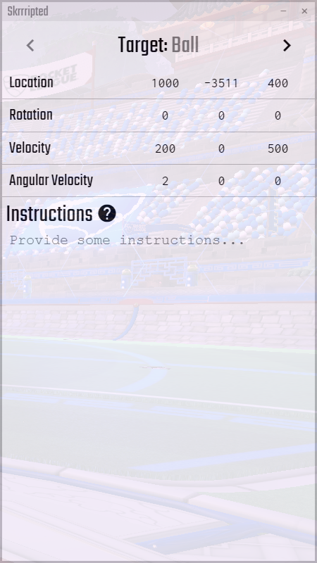

# Skrrripted

Skrrripted is an app which allows you to apply frame-perfect inputs to multiple agents.




# Installation

To install skrrripted, clone or download this repository and copy the root folder to `%AppData%\Local\RLBotGUI\MyBots`. *Eventually, this bot will be directly available via the bot pack, but for now this is the recommneded method.*

**Note: You will need to set your game's FPS to 60 for consistent results.** It's at the bottom left of Rocket League's "video" settings tab. Frame drops will also cause inconsistencies, so make sure that your game runs at a consistent 60 FPS.

# Basics: Position & Rotation

The GUI can control the initial spawn position, rotation, velocity, and angular velocity of the ball and all available skrrripted agents.

Location is comprised of 3 elements, X, Y, and Z. X controls the side-to-side position, Y controls the upfield/downfield position, and Z controls the elevation.

Rotation is decided by pitch, roll, and yaw. Pitch is what change when you frontflip or backflip. Roll is what changes when you sideflip, and yaw is what changes when you turn.

Velocity is the speed at which the ball moves. X, Y, and Z control movement speed along their given location axes.

Angular velocity is the same as velocity, except it changes the rotation speed rather than the movement speed.

# Basics: Instructions

### Below is a list of instructions and their uses:

```
backward = in air: backward roll, on ground: brake/reverse
boost = in air: boost, on ground: boost
drift = in air: do nothing, on ground: handbrake
forward = in air: forward roll, on ground: throttle
jump = in air: dodge, on ground: jump
roll-l = in air: air roll left, on ground: do nothing
roll-r = in air: air roll right, on ground: do nothing
turn-l = in air: spin left, on ground: turn left
turn-r = in air: spin right, on ground: turn right
```

While in air, combine jump with forward, backward, roll-l, or roll-r
for a flip in the given direction, for diagonal flips, set forward
or backward 1 tick before setting roll-l or roll-r and jump.

### The `wait` Keyword

Think of the wait keyword as a divider. each division consists of
one or more inputs, each beginning at the exact same moment. no
command or keyword apart from wait will actually delay the start
time of any other instruction, meaning you can easily combine
multiple inputs and delay as needed, a la the best of both worlds.

### Example Script

In this example, the car will boost for 70 ticks. The next command,
jump, will not wait for this 70 ticks, instead, it will wait for 50,
as specified by the wait keyword. Then, 10 ticks after that, it will
hold forward and jump again, front-flipping the car. Then, 30 ticks
after that, it will begin to boost again, for 100 more ticks.

```
boost 70
wait 50
jump 1
wait 10
forward 1
jump 1
wait 30
boost 100
```

Given that 60 ticks is equal to 1 second, this script has a total run time of 3.1666~ seconds, including the 100 tick boost at the end.

# Known Issues

Sometimes, scripts starts from the kickoffs can be inconsistent. Make sure to pause and unpause your game at least once after a kickoff to avoid this.

The skrrripted interface may not always open due to leftover temporary files. To fix this, press "Start Match" again in the RLBot GUI. You may have to do this twice on rare occasions.