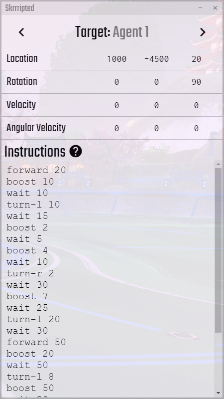

# Skrrripted

Skrrripted is an app which allows you to apply frame-perfect inputs to multiple agents.

# Usage (For Dummies)

To install skrrripted, clone or download this repository and copy the root folder to `%AppData%\Local\RLBotGUI\MyBots`. *Eventually, this bot will be directly available via the bot pack, but for now this is the recommneded method.*

**Note: You will need to set your game's FPS to 60 for consistent results.** It's at the bottom left of Rocket League's "video" settings tab. Frame drops will also cause inconsistencies, so make sure that your game runs at a consistent 60 FPS.